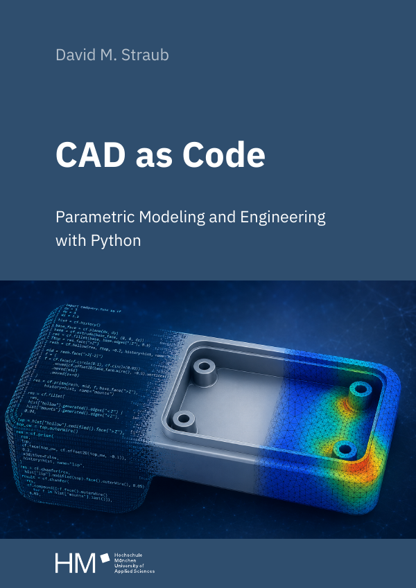

# CAD as Code



**Parametric Modeling and Engineering with Python**
by David M. Straub

A book about building real engineering geometry in code: boundary
representations, the mathematics of curves and surfaces, freeform modeling,
models you can test and release, meshing, simulation, and searching a design
space. It uses [CadQuery](https://github.com/CadQuery/cadquery) and the
OpenCascade kernel throughout.

Published by HM Munich University of Applied Sciences.
DOI [10.60948/OPUS-1358](https://doi.org/10.60948/OPUS-1358) ·
URN `urn:nbn:de:bvb:m347-opus-13585`

<br clear="right">

## Contents

**Part I: Parts from Code**

1. The Case for CAD as Code
2. First Parts
3. Profiles into Solids
4. Designing with Parameters

**Part II: Under the Hood**

5. Anatomy of a Solid
6. The Mathematics of Shape
7. Freeform Modeling

**Part III: Engineering as Software**

8. Models You Can Trust
9. Assemblies and Release Pipelines
10. From Solids to Meshes
11. Simulation
12. Searching the Design Space

## Repository layout

| Path | Contents |
| --- | --- |
| `chapters/` | The book text, as MyST Markdown |
| `figures/*.py` | Scripts that generate every figure |
| `figures/generated/` | Their committed output (so the book builds without running them) |
| `figures/static/` | Hand-drawn and hand-edited figures |
| `template/` | The Typst book template (`jtex`) |
| `myst.yml` | Project and export configuration |

## Building the book

The PDF build needs only [MyST](https://mystmd.org) and
[Typst](https://typst.app), because the generated figures are committed.

```bash
npm install -g mystmd     # myst v1.10+
# install typst 0.15+ (https://github.com/typst/typst), then:
make build                # -> main.pdf
```

Typst 0.15 or newer is required (the template uses variable fonts).

Other targets:

```bash
make watch     # live preview
make pdfa      # PDF/A-2b output, for archiving
make clean     # remove _build/
```

## Regenerating the figures

Only needed if you change a figure script. This pulls in the full CAD and
simulation stack, which is pinned in `pyproject.toml` and locked in `uv.lock`:

```bash
uv sync --group figures
uv run make figures
```

Figures are rendered off-screen with PyVista/VTK. Output depends on the GPU and
driver, so the same script on another machine gives a visually identical file
with different bytes, even at identical package versions. Review a figure
change by opening the image.

## License

This repository is dual-licensed:

- **The book** – all prose in `chapters/` and all figures in
  `figures/generated/` and `figures/static/` – is licensed under
  [Creative Commons Attribution 4.0 International](https://creativecommons.org/licenses/by/4.0/)
  (see [`LICENSE`](LICENSE)).
- **The code** – all code examples in the text, the figure scripts in
  `figures/`, and the Typst template in `template/` – is licensed under the
  MIT License (see [`LICENSE-CODE`](LICENSE-CODE)), so you can lift anything
  from the book into your own work without attribution obligations.

## Citing

See [`CITATION.cff`](CITATION.cff), or use the "Cite this repository" button on
GitHub.

## Corrections

If you find an error, please open an issue. See
[`CONTRIBUTING.md`](CONTRIBUTING.md).
